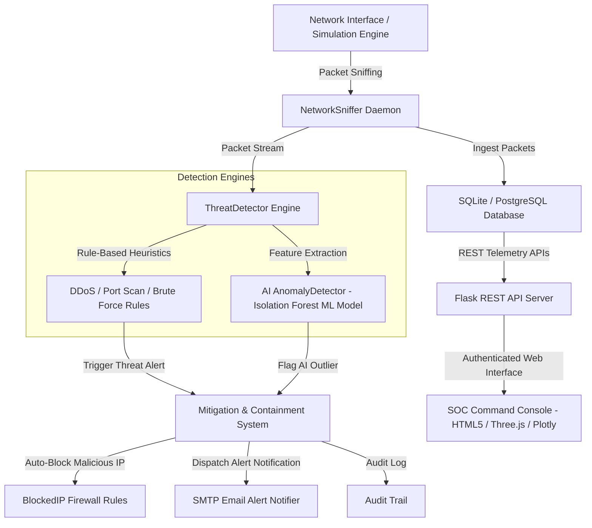

# SHIELD_IDS — AI-Powered Cyber Threat Detection & Network Monitoring System

[](LICENSE)
[](https://www.python.org/)
[](https://flask.palletsprojects.com/)
[](https://www.docker.com/)
[](https://www.postgresql.org/)

**SHIELD_IDS** is an enterprise-grade, autonomous Cyber Threat Detection & Network Security Operations Center (SOC) Command Console. It captures real-time network traffic, correlates multi-vector security threats using rule-based heuristics and an **Isolation Forest Machine Learning model**, enforces automated firewall IP mitigation, and presents an interactive glassmorphism telemetry dashboard.

---

## 📐 System Architecture



---

## ✨ Features

- **Autonomous Threat Detection**: Identifies DDoS floods, Port Scanning sequences, Brute Force authentication attacks, and AI Isolation Forest anomaly outliers.
- **Auto Mitigation & Containment**: Instantly provisions automatic IP block rules for critical and high-severity security threats.
- **Futuristic SOC Console UI/UX**: Built with dark void glassmorphism, Three.js 3D threat globe canvas, custom mouse spring physics, and Plotly dark telemetry charts.
- **3-Breakpoint Responsive Layout**: Seamlessly operates across Desktop (1440px+), Tablet (768px), and Mobile (375px) viewports with collapsible drawer navigation.
- **Dual Database Engine Support**: Out-of-the-box SQLite for local development and PostgreSQL for production deployments.
- **Secure Authentication & RBAC**: Password hashing (scrypt), JWT token authentication, CSRF protection, rate limiting, Forgot Password reset flow, Email Verification, and 3-tier Role-Based Access Control (`Admin`, `Analyst`, `Viewer`).
- **Export & Compliance Reporting**: Download full threat logs and audit trails as formatted `.csv` or `.pdf` reports.

---

## 🛠️ Quick Start & Installation (Local Development)

### 1. Prerequisites
- Python 3.11 or 3.12
- Git

### 2. Clone Repository
```bash
git clone https://github.com/Krishnan533/AI-Powered-Cyber-Threat-Detection-System.git
cd AI-Powered-Cyber-Threat-Detection-System
```

### 3. Setup Virtual Environment
```bash
# Windows
python -m venv venv
venv\Scripts\activate

# Linux / MacOS
python3 -m venv venv
source venv/bin/activate
```

### 4. Install Dependencies
```bash
pip install -r requirements.txt
```

### 5. Environment Configuration
Copy the `.env.example` file to `.env`:
```bash
cp .env.example .env
```

### 6. Run Application
```bash
# Windows (PowerShell)
$env:PYTHONPATH="."
python backend/app.py

# Linux / MacOS
PYTHONPATH=. python3 backend/app.py
```

Open your browser and navigate to `http://127.0.0.1:5000/`.

---

## 🔑 Default Credentials

| Username | Password | Role / Access Level |
| :--- | :--- | :--- |
| `admin` | `AdminPass123!` | Full System Administration, User Management, & Settings |
| `analyst` | `AnalystPass456!` | Threat Investigation, IP Blocking, & Exporting Reports |
| `viewer` | `ViewerPass789!` | Read-Only Dashboard Telemetry Access |

---

## 🐳 Docker Deployment

### Run with Docker Compose
To launch the full web application along with a dedicated database container:
```bash
docker-compose up --build -d
```

### Build & Run Root Docker Container
```bash
docker build -t shield-ids:latest .
docker run -d -p 5000:5000 --name shield-ids-container shield-ids:latest
```

---

## 🌐 Production Cloud Deployment Guides

### 1. Render (1-Click Deployment)
This repository includes a `render.yaml` blueprint:
1. Connect your GitHub repository on [Render](https://render.com/).
2. Select **New Blueprint Instance**.
3. Render will automatically provision a **Web Service** (Gunicorn) and a **PostgreSQL Database**.

### 2. Railway
1. Create a new project on [Railway](https://railway.app/).
2. Select **Deploy from GitHub repo** and choose `AI-Powered-Cyber-Threat-Detection-System`.
3. Add a **PostgreSQL** database service and attach `DATABASE_URL` to your web service variables.

### 3. AWS (Elastic Beanstalk / App Runner / ECS)
1. Deploy container via **AWS App Runner** or **AWS ECS (Fargate)** using the root `Dockerfile`.
2. Connect an **AWS RDS PostgreSQL** instance by configuring `DATABASE_URL` in environment variables.

### 4. DigitalOcean App Platform / Droplet
1. Create a **Droplet** (Ubuntu 22.04 LTS).
2. Install Docker & Nginx.
3. Configure Nginx reverse proxy using the provided template at [docs/deployment/nginx.conf](docs/deployment/nginx.conf).
4. Issue Let's Encrypt SSL certificate:
   ```bash
   sudo apt install certbot python3-certbot-nginx
   sudo certbot --nginx -d shield-ids.example.com
   ```

---

## 🔒 HTTPS & Nginx Reverse Proxy Setup

A production Nginx configuration file is provided at [`docs/deployment/nginx.conf`](docs/deployment/nginx.conf).

### Sample Nginx Reverse Proxy Snippet:
```nginx
server {
    listen 80;
    server_name shield-ids.example.com;
    return 301 https://$host$request_uri;
}

server {
    listen 443 ssl http2;
    server_name shield-ids.example.com;

    ssl_certificate /etc/letsencrypt/live/shield-ids.example.com/fullchain.pem;
    ssl_certificate_key /etc/letsencrypt/live/shield-ids.example.com/privkey.pem;

    location / {
        proxy_pass http://127.0.0.1:5000;
        proxy_set_header Host $host;
        proxy_set_header X-Real-IP $remote_addr;
        proxy_set_header X-Forwarded-For $proxy_add_x_forwarded_for;
        proxy_set_header X-Forwarded-Proto $scheme;
    }
}
```

---

## 📑 REST API Documentation Reference

| Method | Endpoint | Description | Access Level |
| :--- | :--- | :--- | :--- |
| `POST` | `/api/auth/login` | Authenticates user and returns JWT token & session | Public |
| `POST` | `/api/auth/register` | Registers a new analyst or viewer user account | Public |
| `POST` | `/api/auth/forgot-password` | Generates password reset token | Public |
| `POST` | `/api/auth/reset-password` | Resets user password with token | Public |
| `GET` | `/api/dashboard/stats` | Returns aggregated packet, threat, and block stats | Authenticated |
| `GET` | `/api/dashboard/timeline` | Returns 5-minute binned telemetry packet & threat counts | Authenticated |
| `GET` | `/api/dashboard/top-ips` | Returns top source and destination IP analytics | Authenticated |
| `GET` | `/api/dashboard/live-feed` | Returns 10 most recent packets and active threat alerts | Authenticated |
| `POST` | `/api/dashboard/retrain` | Triggers background retrain of ML Isolation Forest model | Admin / Analyst |
| `GET` | `/api/threats` | Returns paginated threat logs with search & severity filters | Authenticated |
| `POST` | `/api/threats/<id>/resolve` | Resolves or marks threat as false positive | Admin / Analyst |
| `GET` | `/api/blocked-ips` | Returns active firewall IP block list | Authenticated |
| `POST` | `/api/blocked-ips` | Manually blocks an IP address | Admin / Analyst |
| `DELETE` | `/api/blocked-ips/<id>` | Unblocks a restricted IP address | Admin |
| `GET` | `/api/logs/audit` | Returns user audit trail logs | Admin / Analyst |
| `GET` | `/api/users` | Returns list of registered user accounts | Admin |
| `GET` | `/api/settings` | Returns system detection thresholds & SMTP parameters | Admin / Analyst |

---

## 🧪 Running Unit Tests

Run the full automated test suite using `pytest`:
```bash
pytest tests/
```

Expected output:
```
tests/test_admin.py ....                                                 [ 23%]
tests/test_api.py ...                                                    [ 41%]
tests/test_auth.py ....                                                  [ 64%]
tests/test_detector.py ..                                                [ 76%]
tests/test_jwt.py ....                                                   [100%]
============================= 17 passed in 6.82s ==============================
```

---

## 📜 License

Distributed under the MIT License. See [`LICENSE`](LICENSE) for more details.
