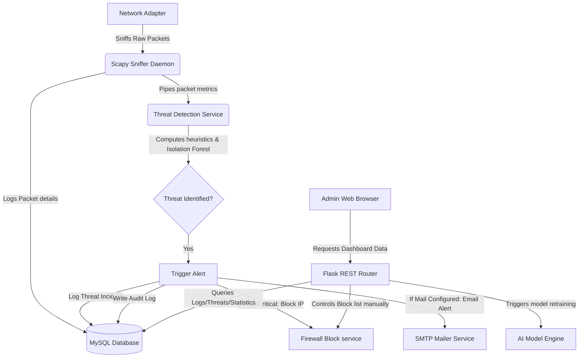

# System Architecture Documentation

This document describes the design, threads boundary, and execution flow of the **AI-Powered Cyber Threat Detection and Network Monitoring System**.

---

## System Decomposition

The system is split into three main components:
1. **Collector Core (Background Thread)**: Scapy-based sniffer running as a persistent daemon thread within the Python runtime.
2. **Analysis & Logic Engine**: Security heuristics engine coupled with a scikit-learn Isolation Forest outlier predictor.
3. **Control Interface (Flask Application)**: Responsive REST API and Bootstrap 5 administrator panels.

---

## 1. Background Packet Sniffer (`packet_capture/`)

The sniffer runs concurrently with the web server. It hooks onto a selected network interface (or triggers traffic simulation if NPM / NPCap headers are absent or if set to simulation mode in `.env`).

- **Live Capture Mode**: Uses Scapy's `sniff` loop. For each packet, it extracts Layer 3 (IP source, destination) and Layer 4 metrics (TCP ports, UDP ports, TCP flags, sequence sizes).
- **Simulation Fallback Mode**: Employs a random walk generator that simulates real-world user activity (DNS resolution, HTTPS traffic) alongside randomized security event signals (failed logins, DDoS bursts, network scanning).
- **Database Threading Model**: Packet logs are committed to the MySQL database in real-time. The sniffer session borrows connection pools from the Flask app context, ensuring thread safety via SQLAlchemy session binds.

---

## 2. Threat Analysis Engine (`backend/services/threat_detector.py`)

Every captured packet metadata entry is parsed through a rule-based pipeline alongside the machine learning anomaly checker.

### Rule-Based Checks
- **DDoS Heuristics**: Compares packet count from a specific IP source in a sliding 1-second in-memory deque window. Flags a threat if count exceeds `100 packets/sec`.
- **Port Scanning**: Aggregates unique destination ports queried by an IP source within a sliding 10-second window. Flags a threat if distinct ports exceed `15`.
- **Brute Force Connection Pattern**: Inspects TCP connection frequency targeting auth-critical services (SSH/RDP/FTP/Telnet). Flags a threat if connection counts exceed `10 attempts/min`.
- **Malware Signatures**: Cross-references against signature Trojan/IRC backdoor ports (e.g. 6667, 31337, 4444).

### AI Anomaly Checks
- **Features**: `[packet_size, protocol_numeric, src_port, dst_port, time_delta]`.
- Input parameters are standardized using a pre-saved `StandardScaler` binary, then passed to the serialized `IsolationForest` model.
- Outliers (labeled `-1` by scikit-learn) generate a **Threat Severity Score** based on the decision function distance from the model boundary.

---

## 3. Web Control Desk & APIs (`backend/`)

Built on the Flask micro-framework, the frontend queries REST interfaces asynchronously to populate charts, timelines, and audit logs.

- **Role Boundaries**:
  - `Admin`: Full access, including manual unblocking of IPs, viewing system diagnostic diagnostics logs, and retraining the anomaly detector.
  - `Analyst`: Middle tier, including status updates of threat entries and creating manual firewall block rules.
  - `Viewer`: Read-only telemetry views.
- **Auditing**: Operational modifications (manual blocking, status resolutions, user authorization actions) are committed to the `audit_logs` database table.
